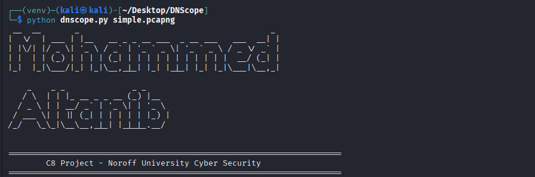

# DNScope 🔍



This project was created as part of my **Bachelor Project (C8 - Noroff University, Cyber Security)**.  
It focuses on analyzing **DNS Internet Background Radiation** using Cloud Telescope datasets.

During the development I faced multiple challenges, especially when working on **Kali Linux**:
- Errors while installing heavy Python libraries like `pyarrow` and `geopandas`.
- Missing system dependencies (`cmake`, `gdal`, `libgeos`, `libproj`).
- GeoIP and shapefile data not being found.
- Understanding how to classify benign vs suspicious DNS queries.

These problems required installing additional packages, testing multiple times, and carefully debugging until the tool produced the correct results (CSV reports, charts, and GeoIP world maps).

Now the tool works fully and can:
- Extract DNS data from PCAP/PCAPNG files.
- Classify, analyze and visualize queries.
- Export results as CSV + PNG charts.
- Map IP sources geographically.

---

## 📖 About DNScope

DNScope is a Python tool for analyzing DNS traffic from PCAP/PCAPNG files.  
It was developed as part of the **Bachelor Project (C8 - Noroff University, Cyber Security)** focusing on **DNS Internet Background Radiation** using **Cloud Telescope datasets**.

The tool performs the following tasks:
- Extracts DNS queries from PCAP/PCAPNG files.
- Classifies queries as **benign** or **suspicious**.
- Saves results into **Parquet** format for fast analysis.
- Runs analytical queries using **DuckDB**.
- Generates **CSV reports and charts (PNG)**.
- Maps source IPs on a **world map** using **GeoIP + GeoPandas**.

---

## 🖼️ Banner Example

When you run the tool, you will see an ASCII banner like this:


---

## 📦 Requirements

Python ≥ 3.9 is recommended.  

Dependencies are listed in `requirements.txt`:

```txt
duckdb==1.1.3
matplotlib==3.10.1
pyfiglet==1.0.2
pandas==2.2.3
scapy==2.6.1
geoip2==4.8.0
geopandas==1.0.1
shapely==2.0.6
pyarrow==17.0.0
