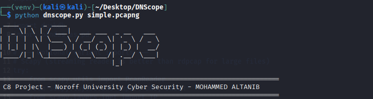

# DNScope 🔍


A Python tool for analyzing **DNS Internet Background Radiation (IBR)** from PCAP/PCAPNG files. Built as part of the **Bachelor Project (C8 – Noroff University, Cyber Security)** using **Cloud Telescope** datasets.

---

## ✨ What it does

* Extracts DNS queries from **PCAP/PCAPNG** files
* Classifies queries as **benign** vs **suspicious** (rule‑based heuristics)
* Writes fast, columnar **Parquet** for analysis
* Executes analytical queries with **DuckDB**
* Exports **CSV reports** and **PNG charts** (domains, IPs, types, classification)
* Plots source IP geolocation on a **world map** (GeoIP + GeoPandas)

---

## 🧪 Why this tool

During development (especially on **Kali Linux**) the following hurdles appeared:

* Heavy Python libs (e.g., `pyarrow`, `geopandas`) failing to build
* Missing system packages (`cmake`, `gdal`, `libgeos`, `libproj`)
* GeoIP & shapefile data not found at runtime
* Practical rules for **benign vs suspicious** DNS classification

These were resolved by carefully installing system deps, using prebuilt wheels where possible, and validating outputs (CSV, charts, world map).

---

## 📦 Requirements

* **Python** ≥ 3.9 (3.10–3.12 recommended)
* **OS:** Linux/macOS/Windows (Linux recommended)
* For maps: access to a **Natural Earth** shapefile and **GeoLite2** database

### Python dependencies (pinning tested versions)

Create `requirements.txt` with:

```txt
duckdb==1.1.3
matplotlib==3.10.1
pyfiglet==1.0.2
pandas==2.2.3
scapy==2.6.1
geoip2==4.8.0
geopandas==1.0.1
shapely==2.0.6
pyarrow==17.0.0
```

> If you don’t need the map, `geoip2`/`geopandas`/`shapely` can be skipped.

---

## 🗂️ Repository layout (recommended)

```
DNScope/
├─ dnscope.py                 # main script
├─ requirements.txt
├─ README.md                  # this file
├─ images/
│  ├─ banner.png
│  └─ banner2.png
├─ world_shapefile/           # Natural Earth shapefile goes here
│  └─ (unzipped .shp/.dbf/.shx/.prj)
├─ outputs/                   # CSV/PNG/Parquet outputs (gitkeep optional)
│  └─ .gitkeep
└─ examples/
   └─ sample.pcapng           # optional demo capture
```

---

## 🚀 Quick start (single terminal block)

> Run these on your analysis machine (Kali/Ubuntu/macOS). Adjust paths as needed.

```bash
# 1) Create & activate a virtual environment
python3 -m venv venv
. venv/bin/activate  # (Linux/macOS)  
# venv\Scripts\activate  # (Windows PowerShell)

# 2) Install system packages (Linux – needed for Geo/Parquet)
#    Skip if already installed or if you don’t need maps
sudo apt update
sudo apt install -y cmake build-essential libgeos-dev libproj-dev gdal-bin unzip wget

# 3) Install Python deps (prefer wheels for pyarrow)
pip install --upgrade pip
pip install --only-binary=:all: pyarrow
pip install -r requirements.txt

# 4) (Optional) Download Natural Earth shapefile for world map
mkdir -p world_shapefile && cd world_shapefile
wget https://naciscdn.org/naturalearth/110m/cultural/ne_110m_admin_0_countries.zip
unzip -o ne_110m_admin_0_countries.zip
cd ..

# 5) (Optional) Ensure GeoLite2 City DB exists at default path
#    Default looked-up path used by many tools:
#    /usr/share/GeoIP/GeoLite2-City.mmdb
#    If you keep it elsewhere, see the script’s CLI options or config.

# 6) Run DNScope on a PCAP/PCAPNG
python3 dnscope.py examples/sample.pcapng
# or
python3 dnscope.py /path/to/your.pcap

# 7) Check outputs
ls -1 outputs
# expected (examples):
#  - dns.parquet
#  - top_domains.csv   top_domains.png
#  - top_ips.csv       top_ips.png
#  - query_types.csv   query_types.png
#  - classification_stats.csv  classification.png
#  - world_map_ips.png (if shapefile + GeoIP available)
```

---

## ▶️ Usage

Basic:

```bash
python3 dnscope.py <input.pcapng>
python3 dnscope.py <input.pcap>
```

Outputs (in `./outputs/` by default):

* **Parquet:** `dns.parquet`
* **CSV:** `top_domains.csv`, `top_ips.csv`, `query_types.csv`, `classification_stats.csv`
* **Charts (PNG):** `top_domains.png`, `top_ips.png`, `query_types.png`, `classification.png`
* **Geo map:** `world_map_ips.png` (requires shapefile + GeoLite2)

> If your script supports CLI flags (e.g., output directory, file limits, or custom GeoIP path), document them here (e.g., `--out`, `--limit`, `--geoip-db`).

---

## 🧭 Classification (benign vs suspicious)

A pragmatic rule‑based approach is used (examples):

* **Benign hints:** common resolvers; typical `A`/`AAAA`/`MX` lookups to popular domains
* **Suspicious hints:** random‑looking subdomains; unusual TLDs; excessive NXDOMAINs; high entropy; rare types (e.g., `TXT` exfil patterns) in bursts

> Always validate with context. DNS alone can be ambiguous; treat results as **indicators**, not proof.

---

## 🧰 Troubleshooting (Kali/Ubuntu)

**`pyarrow` or `geopandas` build fails** → install missing system deps and prefer wheels:

```bash
sudo apt update
sudo apt install -y cmake build-essential libgeos-dev libproj-dev gdal-bin unzip wget
pip install --only-binary=:all: pyarrow
```

**World map not generated** → ensure the shapefile exists:

```bash
cd world_shapefile
wget https://naciscdn.org/naturalearth/110m/cultural/ne_110m_admin_0_countries.zip
unzip -o ne_110m_admin_0_countries.zip
cd ..
```

**GeoIP database missing** → place **GeoLite2-City.mmdb** at:

```
/usr/share/GeoIP/GeoLite2-City.mmdb
```

(Or point the script to a custom path if supported.)

---

## 📊 Example outputs

* **Tables/CSV:** top domains, top source IPs, query types, classification stats
* **Charts/PNG:** bar charts for domains/IPs/types; pie/stacked chart for classification
* **Map:** `world_map_ips.png` showing geolocated sources



